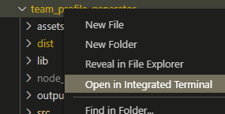

# Employee Tracker

## Description

This is a working Content Management Systems interface built for managing a company's employee database. Allows for searching, adding and updating employees, roles and departments.

## Table of Contents

* [Installation](#Install)
* [Usage](#Usage-Instructions)
* [Contribution](#Contribution-Guidelines)
* [Test](#Test-Instructions)
* [License](#License)

## Installation

Must have Node installed as well as npm dependencies include MySQL, inquirer and console.table and dotenv. Can also connect to a graphical user interface tool such as MySQL Workbench to edit database.

## Usage Instructions

### Open Directory in Integrated Terminal

### Install npm, mysql, inquirer and dotenv

### Run node with "node app.js" in Terminal

### Answer inquirer questions

### You will be able to navigate and update employee database

## Contribution Guidelines

Several tutor sessions.

## Test Instructions

not applicable at this time

## License

not applicable

## Contact

* Github Username: mpagenkopf

* Email: pagenkopf.edit@gmail.com

* Link to Repository: [Repository](https://github.com/mjpagenkopf/employee_tracker)

* Link to Screencastify: [Screencastify Video](https://drive.google.com/file/d/1kFRjroOHet69uz_0DDToFcCjUlkq0b_Z/view)